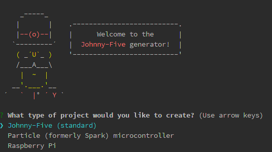
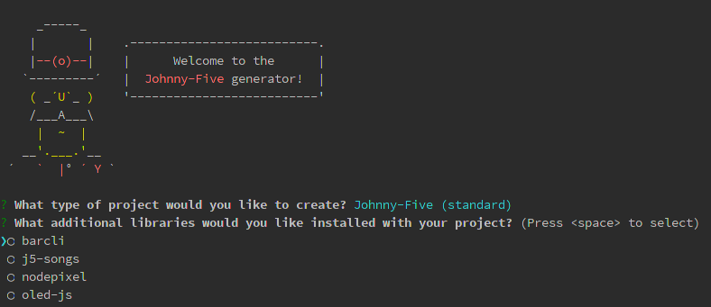
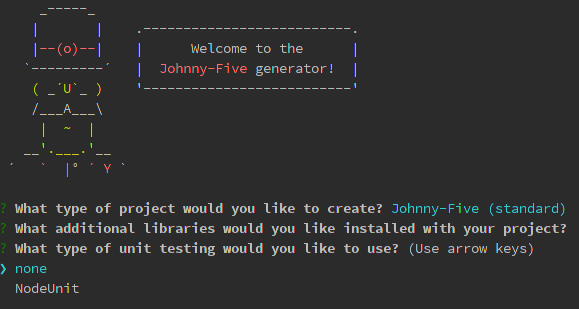
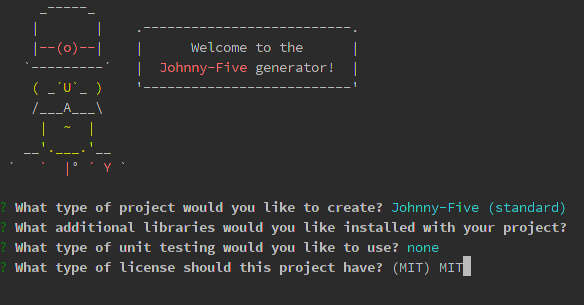

# arduino-js-setup
Installation development environment for building Arduino projects using node.js and johnny-five.js on Linux SO

---
**Sistema operativo**

Ubuntu 14.04.3 LTS

[Ubuntu 14.04.3 LTS Desktop (64-bit) ](http://releases.ubuntu.com/14.04.3/ubuntu-14.04.3-desktop-amd64.iso.torrent)

**Instalación JAVA**
```bash
sudo apt-get update 
sudo apt-get install default-jre
sudo apt-get install default-jdk
```
**Instalación Arduino**

Instalación de dependencias
```bash
sudo apt-get update
sudo apt-get install arduino arduino-core
````

Open-source Arduino Software
```bash
wget ****https://www.arduino.cc/download_handler.php?f=/arduino-1.6.5-linux64.tar.xz
tar xvfJ arduino-1.6.5-linux64.tar.xz
````

Error permiso denegado 
```bash
Error opening serial port '/dev/ttyACM0'. (Permission denied)
````
Con un error de este tipo, usar el siguiente comando:
```bash
sudo usermod -a -G tty <usuario>
sudo usermod -a -G dialout <usuario>
sudo chmod a+rw /dev/ttyACM0
```

**Establecer el StandardFirmata**

Abrir y ejecutar el siguiente sketch desde Arduino Software:
```bash
~/arduino-1.6.5/libraries/Firmata/examples/StandardFirmata/StandardFirmata.ino
````

**Instalación Node.js**

Eliminar paquetes de node instalados previamentes
```bash
dpkg --get-selections | grep node
sudo apt-get remove --purge node
````

Instalación de node y npm
```bash
sudo apt-get install nodejs
sudo apt-get install npm
sudo ln -s /usr/bin/nodejs /usr/bin/node
````

Error npm install -g [package]
```bash
sudo chown -R $USER /usr/local
````

**Crear un proyecto** 

Instalación Yeoman
```bash
npm install -g yo
````

Instalación Johnny-five yeoman generator
```bash
npm install -g generator-johnny-five
```

Generación del proyecto
```bash
mkdir <directorio del proyecto>
cd <directorio del proyecto>
yo johnny-five
`````









